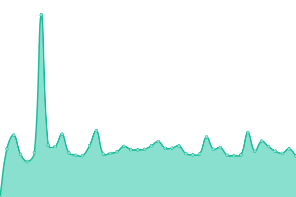

# [📈 Live Status](https://anklav24.github.io/upptime): <!--live status--> **🟧 Partial outage**

This repository contains the open-source uptime monitor and status page for [Aleksandr Lobanov](anklavcode.duckdns.org), powered by [Upptime](https://github.com/upptime/upptime).

With [Upptime](https://upptime.js.org), you can get your own unlimited and free uptime monitor and status page, powered entirely by a GitHub repository. We use [Issues](https://github.com/anklav24/upptime/issues) as incident reports, [Actions](https://github.com/anklav24/upptime/actions) as uptime monitors, and [Pages](https://anklav24.github.io/upptime) for the status page.

<!--start: status pages-->
<!-- This summary is generated by Upptime (https://github.com/upptime/upptime) -->
<!-- Do not edit this manually, your changes will be overwritten -->
<!-- prettier-ignore -->
| URL | Status | History | Response Time | Uptime |
| --- | ------ | ------- | ------------- | ------ |
|  [Anklav Code](https://anklavcode.duckdns.org) | 🟩 Up | [anklav-code.yml](https://github.com/anklav24/upptime/commits/HEAD/history/anklav-code.yml) | 

 1945ms
     
 | 

<a href="https://anklav24.github.io/upptime/history/anklav-code">99.52%</a>
    

|  [4SOULS](https://xn--4-htbm7bza.xn--p1ai) | 🟩 Up | [4-souls.yml](https://github.com/anklav24/upptime/commits/HEAD/history/4-souls.yml) | 

 2110ms
     
 | 

<a href="https://anklav24.github.io/upptime/history/4-souls">100.00%</a>
    

|  [SQCP](https://sqcp.mikrotik24.duckdns.org) | 🟥 Down | [sqcp.yml](https://github.com/anklav24/upptime/commits/HEAD/history/sqcp.yml) | 

 2630ms
     
 | 

<a href="https://anklav24.github.io/upptime/history/sqcp">0.00%</a>
    

|  [Grafana](https://grafana.mikrotik24.duckdns.org) | 🟩 Up | [grafana.yml](https://github.com/anklav24/upptime/commits/HEAD/history/grafana.yml) | 

 4713ms
     
 | 

<a href="https://anklav24.github.io/upptime/history/grafana">99.46%</a>
    

|  [Home Assistant](https://ha-24.duckdns.org) | 🟩 Up | [home-assistant.yml](https://github.com/anklav24/upptime/commits/HEAD/history/home-assistant.yml) | 

 4161ms
     
 | 

<a href="https://anklav24.github.io/upptime/history/home-assistant">99.22%</a>
    

|  [mikrotik24](https://mikrotik24.duckdns.org) | 🟩 Up | [mikrotik24.yml](https://github.com/anklav24/upptime/commits/HEAD/history/mikrotik24.yml) | 

 3690ms
     
 | 

<a href="https://anklav24.github.io/upptime/history/mikrotik24">99.02%</a>
    

|  [zabbix24](https://zabbix24.duckdns.org) | 🟩 Up | [zabbix24.yml](https://github.com/anklav24/upptime/commits/HEAD/history/zabbix24.yml) | 

 2860ms
     
 | 

<a href="https://anklav24.github.io/upptime/history/zabbix24">99.85%</a>
    

|  [Upptime](https://anklav24.github.io/upptime) | 🟩 Up | [upptime.yml](https://github.com/anklav24/upptime/commits/HEAD/history/upptime.yml) | 

 124ms
     
 | 

<a href="https://anklav24.github.io/upptime/history/upptime">100.00%</a>
    

<!--end: status pages-->

[**Visit our status website →**](https://anklav24.github.io/upptime)

## 📄 License

- Powered by: [Upptime](https://github.com/upptime/upptime)
- Code: [MIT](./LICENSE) © [Aleksandr Lobanov](anklavcode.duckdns.org)
- Data in the `./history` directory: [Open Database License](https://opendatacommons.org/licenses/odbl/1-0/)
